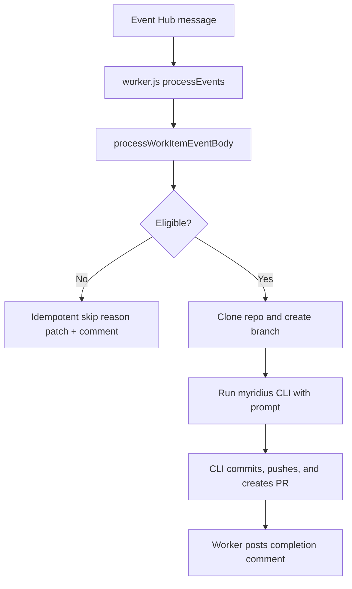

# ACA Code Worker Workflow

This document describes the implemented workflow for the Azure Container Apps code worker under `worker/`.

## 1) Runtime Entry

File: `worker/worker.js`

- Worker starts an `EventHubConsumerClient` using:
  - `EVENT_HUB_CONNECTION_STRING`
  - `EVENT_HUB_NAME`
  - `EVENT_HUB_CONSUMER_GROUP` (default `claude-code-worker`)
- For each Event Hub message, it calls `processWorkItemEventBody(event.body)`.
- Emits operational logs:
  - `aca_claude_worker_starting`
  - `aca_claude_worker_event_processed`
  - `aca_claude_worker_event_failed`
  - `aca_claude_worker_consumer_error`

## 2) Trigger Gate (Policy)

File: `worker/policy.js`, function `evaluateImplementationTrigger(...)`.

Eligibility requires all of the following:
1. Payload has `resource` with revision field changes.
2. `AIPlanningStatus` changed (`oldValue != newValue`).
3. New status equals `ReadyForAIImplementation` (case-insensitive normalization).
4. Work item type resolves to `User Story` or `Story`.
5. Work item ID and revision are present and valid integers.

If any check fails, worker returns `eligible=false` with a reason code.

Note: Policy is driven by status transition and revision field deltas, which are normally present in `workitem.updated` events.

## 3) Skip Reason Taxonomy

Files:
- `worker/config/reason-taxonomy.json`
- `worker/policy.js`

Reason codes used:
- `WrongType`
- `NoStatusTransition`
- `MissingRepoContext`
- `ExecutionSuppressed`
- `InvalidPayload`

Message format (from `buildStatusReasonMessage(...)`):
- `[AI-IMPL-SKIP] key=<skipKey> | code=<reasonCode> | <catalogDescription> | <detail>`

## 4) Idempotent Skip Updates

Files:
- `worker/processWorkItem.js` (`postIdempotentSkipReason`)
- `worker/skip-reason.js` (`computeSkipReasonUpdate`)

Flow:
1. Build deterministic key: `ai-impl-skip:{workItemId}:{revision}:{reasonCode}`.
2. Load work item and current `AIPlanningStatusReason`.
3. If key already exists in field value, skip re-write/comment.
4. Else append reason line to `AIPlanningStatusReason` and post same message as a work item comment.

This prevents duplicate skip writes for repeated delivery of the same revision/reason.

## 5) Happy Path (Implementation)

Primary file: `worker/processWorkItem.js`

1. Normalize message payload (string/buffer/object supported).
2. Evaluate policy gate.
3. Validate repository context (`AZDO_REPO_CLONE_URL`), else skip with `MissingRepoContext`.
4. Fetch work item details via `azdo.getWorkItem(...)`.
5. Create ephemeral workspace under temp directory.
6. Clone repository and create branch `ai/us-{workItemId}-r{revision}`.
7. Render prompt from `worker/prompts/implementation-prompt.md` using:
   - `System.Title`
   - `System.Description`
   - `Microsoft.VSTS.Common.AcceptanceCriteria`
8. Run pinned CLI via `runMyridiusImplementation(...)`:
   - default invocation: `node /app/node_modules/myridius/dist/cli.mjs --print --agent backend-specialist --permission-mode bypassPermissions --dangerously-skip-permissions`
   - optional override: `MYRIDIUS_CLI_COMMAND`
   - env mapping: `MYRIDIUS_OPENAI_*` -> `OPENAI_*`
   - prompt includes deterministic work-item branch name
   - stdin: generated prompt file
9. CLI is responsible for commit/push and PR creation in Azure DevOps.
10. Worker verifies an active PR exists for `ai/us-{workItemId}-r{revision}`.
11. If no active PR is found, worker records `ExecutionSuppressed` and does not mark implemented.
12. Post work item comment that CLI execution completed when active PR is present.
13. Remove ephemeral workspace in `finally` block.

## 6) Azure DevOps API Calls Used

File: `worker/azdo-client.js`

- `GET /_apis/wit/workitems/{id}?$expand=All&api-version=7.1`
- `PATCH /_apis/wit/workitems/{id}?api-version=7.1`
- `POST /_apis/wit/workItems/{id}/comments?api-version=7.1-preview.4`
- `POST /_apis/git/repositories/{repo}/pullrequests?api-version=7.1`

## 7) Required Environment Variables

From `worker/README.md` + runtime code:

- `EVENT_HUB_CONNECTION_STRING`
- `EVENT_HUB_NAME`
- `EVENT_HUB_CONSUMER_GROUP` (optional, default `claude-code-worker`)
- `AZDO_PAT`
- `AZDO_ORG`
- `AZDO_PROJECT`
- `AZDO_REPO`
- `AZDO_REPO_CLONE_URL`
- `GIT_USERNAME`
- `GIT_EMAIL`
- `MYRIDIUS_CLI_AGENT` (optional, default `backend-specialist`)
- `MYRIDIUS_CLI_FULL_AUTO` (optional, default `1`)
- `MYRIDIUS_CLI_PERMISSION_MODE` (optional explicit override)
- `MYRIDIUS_CLI_ALLOW_ROOT_BYPASS` (optional, default `1`)
- `MYRIDIUS_CLI_DANGEROUSLY_SKIP_PERMISSIONS` (optional, default `1`)
- `MYRIDIUS_CLI_COMMAND` (optional explicit override)
- `MYRIDIUS_OPENAI_API_KEY`
- `MYRIDIUS_OPENAI_MODEL_ENDPOINT`
- `MYRIDIUS_OPENAI_DEPLOYMENT_NAME`
- `AI_PLANNING_STATUS_FIELD_REF_NAME` (optional, default `AIPlanningStatus`)
- `AI_PLANNING_STATUS_REASON_FIELD_REF_NAME` (optional, default `AIPlanningStatusReason`)
- `CLAUDE_CONFIG_DIR` (optional, default `/app/config`)

## 8) Outputs and Outcomes

`processWorkItemEventBody(...)` returns one of:
- `category: "implemented"` with `workItemId`, `branchName` (only when an active PR is detected)
- `category: "skipped"` with `reasonCode` and `reason`

These are emitted by `worker.js` in `aca_claude_worker_event_processed` logs for operational tracking.

